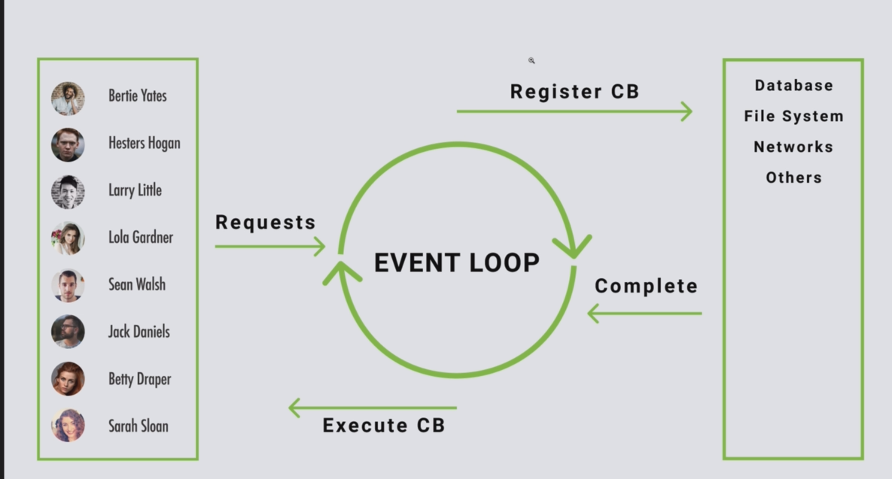

#### buit-in modules
- os
- path
- fs
- http

#### npm

#### upcoming topics
- event-loop

```js
// offer no-blocking I/O
// Bert Belder:Everything you need to know Event-loop
```
- async patterns
```
async / await
promisify
```
- event emitter
```js
const EventEmitter = require('events')

const customEmitter = new EventEmitter()

// on order matters!!!
customEmitter.on('event1',() => {
    console.log('event1')
})

customEmitter.on('event1', () => {
    console.log('event1 rescisdlfjksaldjfxx')
})

customEmitter.emit('event1')
```
- streams
```


const {createReadStream} = require('fs')

const stream = createReadStream('./content/big.txt',{highWaterMark: 90000,encoding:'utf8'})

stream.on('data', (result) => {
    console.log(result)
})

stream.on('error' ,() => {
    console.log('error')
})
```

```

const http = require('http')
const fs = require('fs')

http.createServer((req,res) => {
    const fileStream = fs.createReadStream('./content/big.txt','utf8')
    fileStream.on('open' , (file) => {
        fileStream.pipe(res)
    })

    fileStream.on('error', (err) => {
        res.end(err)
    })
}).listen(5000)
```